# Movie App
**"Movie App - Friendly and Approachable!"**  
Your mini cinema on the go! Enjoy thousands of blockbuster movies and exciting series anytime, anywhere.

## Key Features 

### 1. **Watching Movies**  
- Watching a movie and chose episode.
- Movie quality HD or FHD.
- Has diverse genres

### 2. **Smart Search**  
- Search movie by name or filter by category movie with country, sort type, year.

### 3. **Synchronization and Progress Tracking**  
- Users can save their favorite movies or delete favorite.
- Users can view the history of the movies they have watched in the history settings and can clear that history.

### 4. **User Account Management**  
- Sign up, log in and fortgot account via email.
- Sign in with Google or Facebook.

### 5. **Settings app**
- Watch information profile.
- Change language Vietnamese, English.
- On/off notification.
- Change theme dark, light or system device.

## Technology Stack  

### 1. **Frontend**  
- **Flutter**: A cross-platform framework for developing smooth and intuitive user interfaces.  

### 2. **Backend**  
- **Firebase**:  
  - **Authentication**: Manage user registration, login, and authentication.  
  - **Firestore Database**: Save data favorite movies storage.  

### 3. **API Integration**  
- **RESTful API**: Connect with external services or custom backend features.  
- **Http (Flutter)**: Libraries for making HTTP requests.  

### 4. **State Management**  
- **Riverpod**: Efficiently manage application state.

## Project results

### Image:
Before v1.0.0

 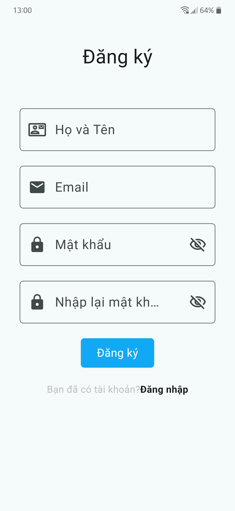  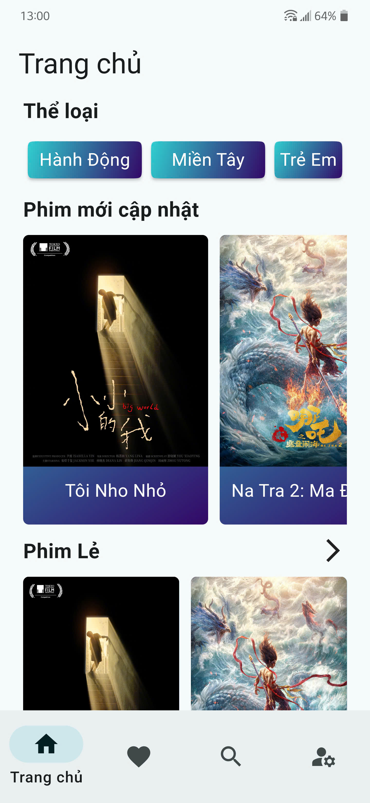 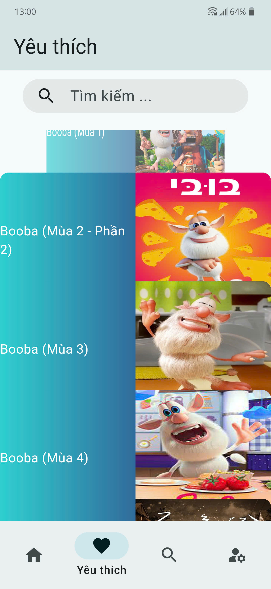 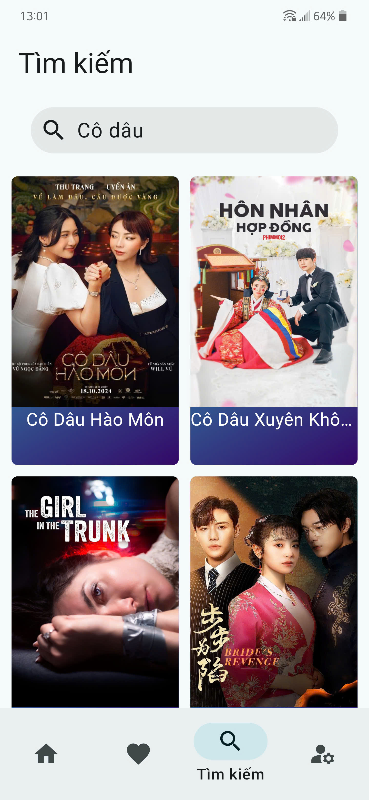 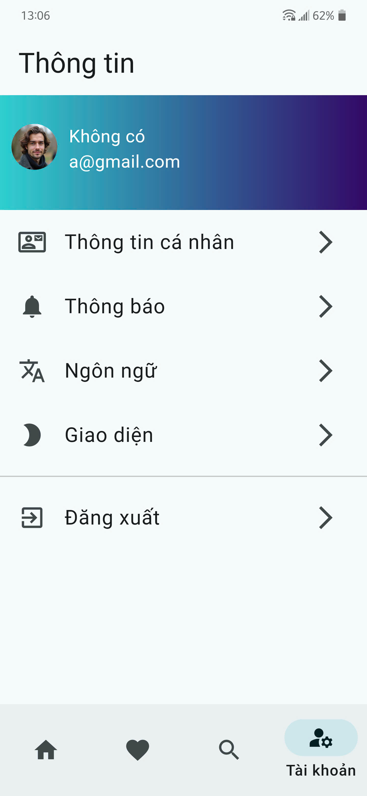 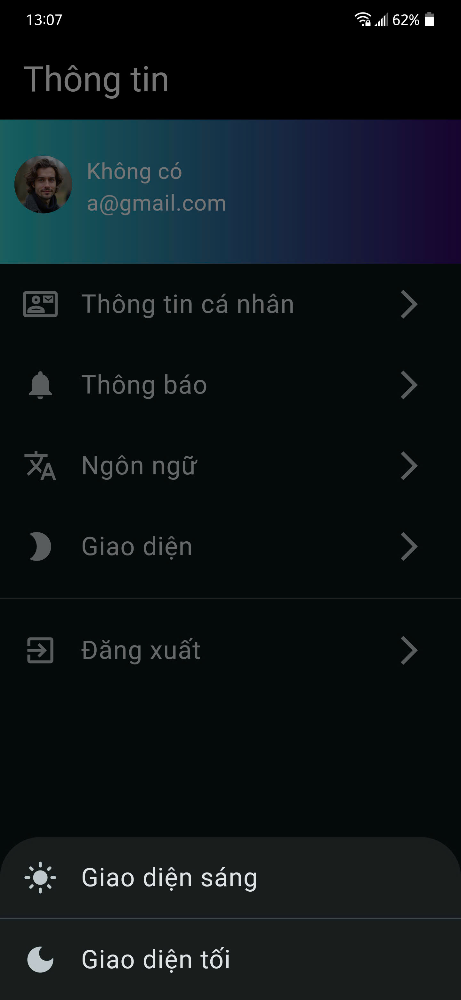 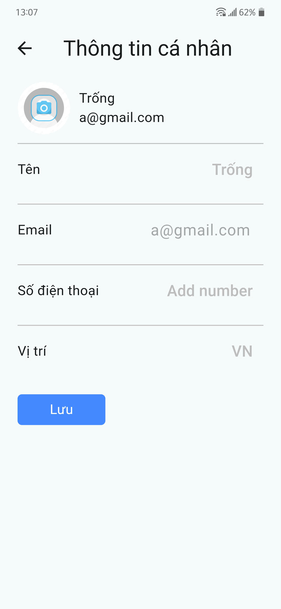 
### Video:

- [Link Cloudinary video demo](https://res.cloudinary.com/dksr7si4o/video/upload/v1738843726/flutter/video_kq/Movie-App-Demo_x5fe39.mp4)
- [Link Youtube video demo](https://youtube.com/shorts/45lzYWR05XI?feature=share)

After v1.0.0

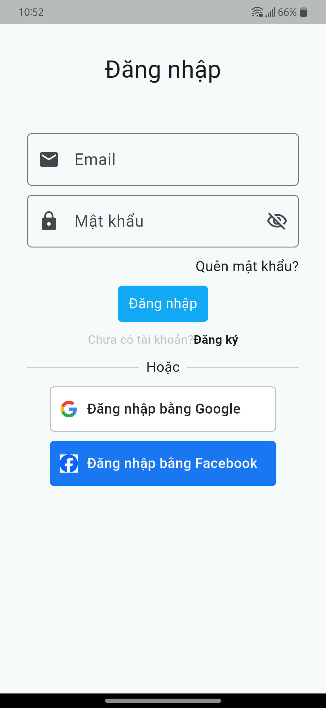 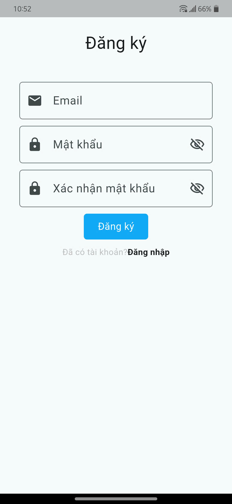  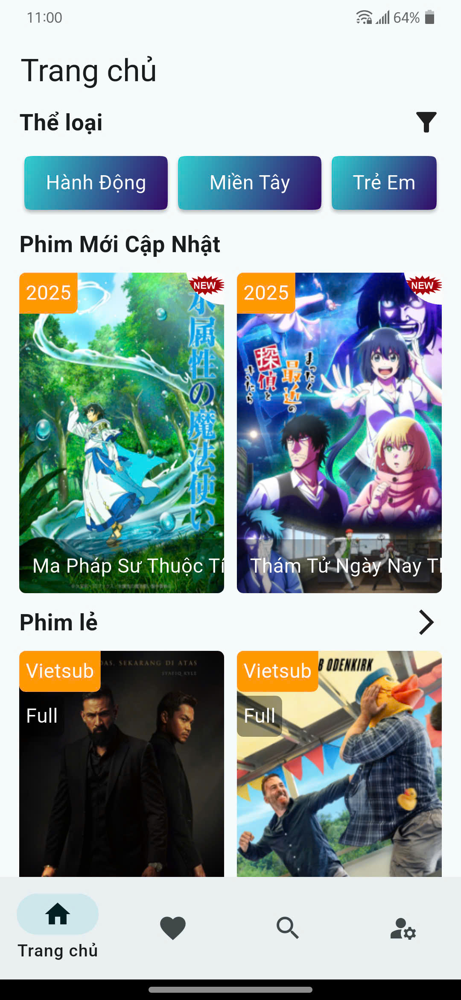 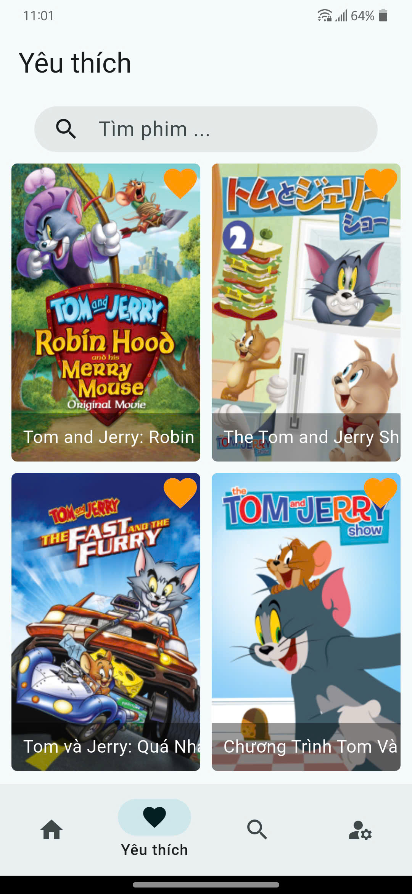 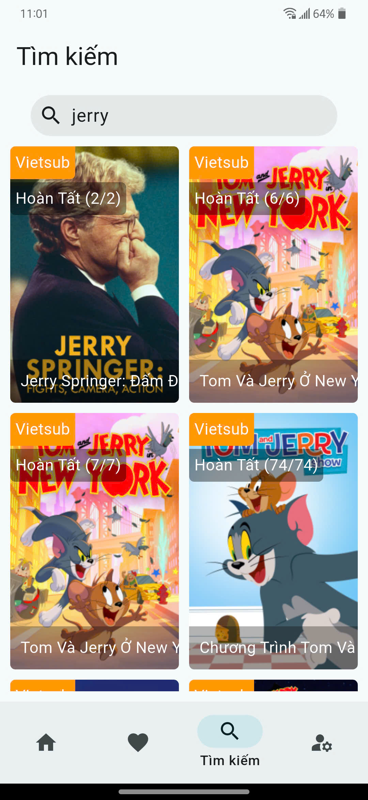 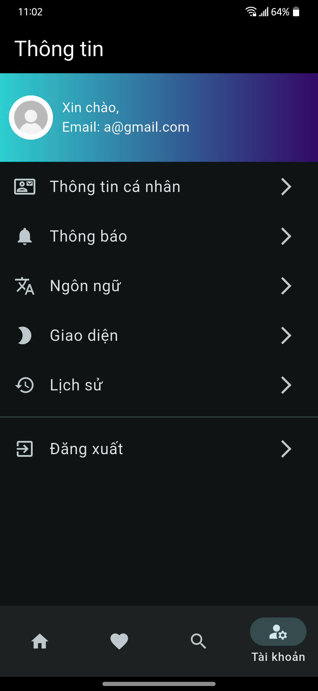  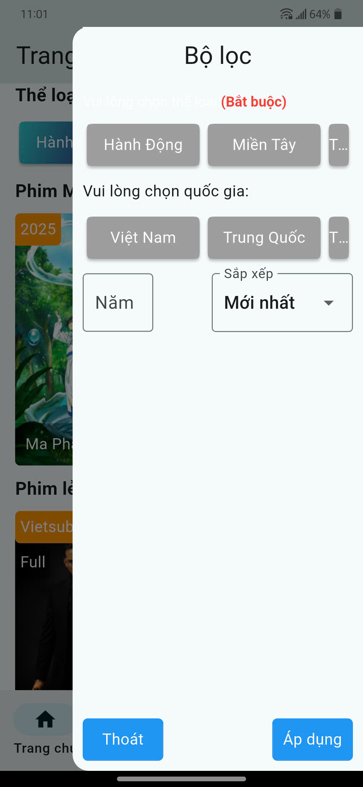 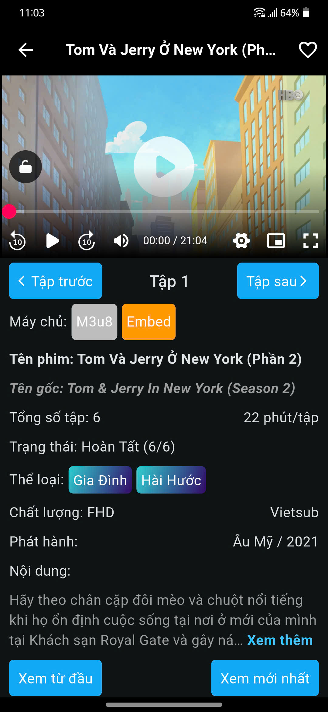 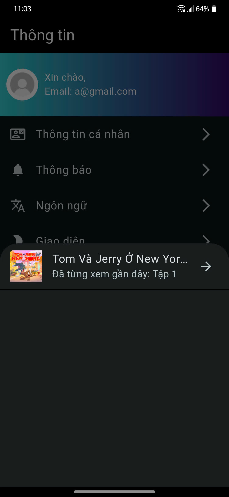
### Video:

- [Link Cloudinary video demo](https://player.cloudinary.com/embed/?cloud_name=dksr7si4o&public_id=flutter%2Fvideo_kq%2F659a87d2-76ea-4072-a0eb-0a1c39cb0674_ujxnpp&profile=cld-default)
<iframe
  src="https://player.cloudinary.com/embed/?cloud_name=dksr7si4o&public_id=flutter%2Fvideo_kq%2F659a87d2-76ea-4072-a0eb-0a1c39cb0674_ujxnpp&profile=cld-default"
  width="640"
  height="360" 
  style="height: auto; width: 100%; aspect-ratio: 640 / 360;"
  allow="autoplay; fullscreen; encrypted-media; picture-in-picture"
  allowfullscreen
  frameborder="0"></iframe>